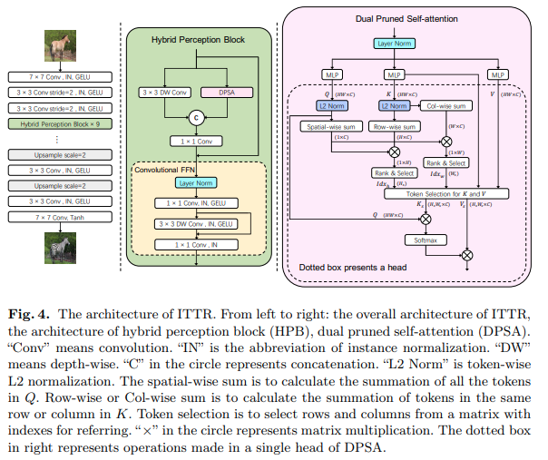

</img>

## ITTR - Pytorch

Implementation of the Hybrid Perception Block (`HPB`) and Dual-Pruned Self-Attention (`DPSA`) block from the <a href="https://arxiv.org/abs/2203.16015">ITTR paper</a> for Image to Image Translation using Transformers.

## Install

```bash
$ pip install ITTR-pytorch
```

## Usage

They had 9 blocks of Hybrid Perception Block (HPB) in the paper

```python
import torch
from ITTR_pytorch import HPB

block = HPB(
    dim = 512,              # dimension
    dim_head = 32,          # dimension per attention head
    heads = 8,              # number of attention heads
    attn_height_top_k = 16, # number of top indices to select along height, for the attention pruning
    attn_width_top_k = 16,  # number of top indices to select along width, for the attention pruning
    attn_dropout = 0.,      # attn dropout
    ff_mult = 4,            # expansion factor of feedforward
    ff_dropout = 0.         # feedforward dropout
)

fmap = torch.randn(1, 512, 32, 32)

out = block(fmap) # (1, 512, 32, 32)
```

You can also use the dual-pruned self-attention as so

```python
import torch
from ITTR_pytorch import DPSA

attn = DPSA(
    dim = 512,         # dimension
    dim_head = 32,     # dimension per attention head
    heads = 8,         # number of attention heads
    height_top_k = 48, # number of top indices to select along height, for the attention pruning
    width_top_k = 48,  # number of top indices to select along width, for the attention pruning
    dropout = 0.       # attn dropout
)

fmap = torch.randn(1, 512, 32, 32)

out = attn(fmap) # (1, 512, 32, 32)
```

## Citations

```bibtex
@inproceedings{Zheng2022ITTRUI,
  title   = {ITTR: Unpaired Image-to-Image Translation with Transformers},
  author  = {Wanfeng Zheng and Qiang Li and Guoxin Zhang and Pengfei Wan and Zhongyuan Wang},
  year    = {2022}
}
```
